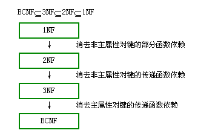

## 数据库范式总结

范式：英文名称是 Normal Form，通常用到的范式有四种，即：第一范式（1NF），第二范式（2NF），第三范式（3NF），BCNF。

* 1NF：指数据库表的每一列都是原子的，不可再分割的。即无重复的列。
* 2NF：首先要符合1NF，其次要有主键，最后所有非主键列要完全依赖主键，不能只依赖主键的一部分。
* 3NF：首先要符合2NF，另外，非主键列不能依赖于其他非主键列。即非主键列必须直接依赖于主键，不能存在传递依赖。
* BCNF：首先要符合3NF，另外，主键列之间不存在依赖。

### 判断表设计是否符合范式

可以看表是否存在以下问题：数据冗余，更新异常，删除异常，新增异常。

### 范式判断流程图

### 范式关系图

