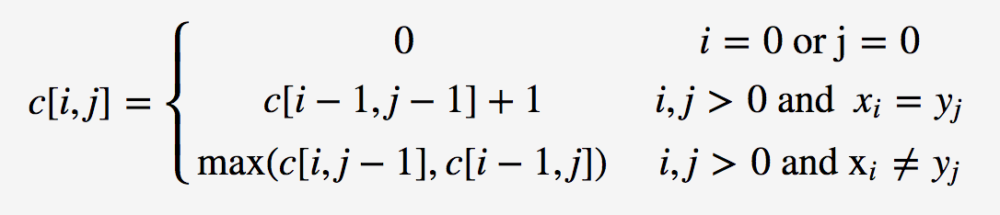

## [583. Delete Operation for Two Strings](https://leetcode.com/problems/delete-operation-for-two-strings/description/)

### 题目描述
Given two words `word1` and `word2`, find the minimum number of steps required to make `word1` and `word2` the same, where in each step you can delete one character in either string.

**Example 1:**
```
Input: "sea", "eat"
Output: 2
Explanation: You need one step to make "sea" to "ea" and another step to make "eat" to "ea".
```
**Note:**
* The length of given words won't exceed 500.
* Characters in given words can only be lower-case letters.

### 解题思路
 首先要搞懂题意。这题说的是：任意两个字符串（长度不超过500，均为小写字母），每一步可以从任何一个串里删除一个字母，问最少经过多少步就可以使两个串相同。  
根据经验，这题可以通过求`最长公共子序列（ longest common subsequence, LCS）`来解决。  
假设两个字符串分别为 s1, s2. 最长公共子序列为 lcs, 那么最少步数为：`(s1.size-lcs.size) + (s2.size-lcs.size)`

那么，怎么求最长公共子序列（LCS）呢？这种求最优解的问题，一般通过动态规划求取。  
用动态规划求解主要套路是：把原问题分解成具有最优解的子问题，并用额外的数据结构保存中间结果。找出递归公式。
下面我们来分析下怎么利用动态规划求解 LCS。

LCS 的特征：

设序列X={x1, x2, …, xm}和Y={y1, y2, …, yn}的一个最长公共子序列Z={z1, z2, …, zk}，则：

1. 若xm=yn，则zk=xm=yn且Z(k-1)是X(m-1)和Y(n-1)的最长公共子序列；
2. 若xm≠yn且zk≠xm ，则Z是X(m-1)和Y的最长公共子序列；
3. 若xm≠yn且zk≠yn ，则Z是X和Y(n-1)的最长公共子序列。

其中X(m-1)={x1, x2, …, x(m-1)}，Y(n-1)={y1, y2, …, y(n-1)}，Z(k-1)={z1, z2, …, z(k-1)}。

根据 LCS 的特征，我们可以发现，要求 `x1 ... xm & y1 .. y(n-1)` 的 LCS 和 `x1 ... x(m-1) & y1 .. yn` 的 LCS，一定会递归地计算 x1 ... x(m-1) 与 y1 ... y(n-1) 的 LCS。所以我们需要一个数据结构来记录中间结果，避免重复计算。

假设我们用c[i,j]表示 Xi 和 Yj 的`LCS的长度`（重点）。其中X = {x1 ... xm}，Y ={y1 ... yn}，Xi = {x1 ... xi}，Yj={y1 ... yj}。可得递归公式如下：



### 实现代码

#### go
```go
package main

func minDistance(word1 string, word2 string) int {
    if(len(word1)==0){
        return len(word2)
    }
    if(len(word2) ==0){
        return len(word1)
    }
    dp := make([][]int, len(word1) + 1)
    for i := range dp {
        dp[i] = make([]int, len(word2) + 1)
    }
    for i := 1; i<=len(word1); i++{
        for j := 1; j<=len(word2); j++{
            if word1[i - 1] == word2[j - 1] {
                dp[i][j] = dp[i - 1][j - 1] + 1
            }else{
                dp[i][j] = max(dp[i - 1][j], dp[i][j - 1])
            }
        }
    }
    return len(word1) + len(word2) - 2 * dp[len(word1)][len(word2)]
}
func max(first int, args... int) int {
    for _ , v := range args{
        if first < v {
            first = v
        }
    }
    return first
}
```

## [5. Longest Palindromic Substring](https://leetcode.com/problems/longest-palindromic-substring)

### 题目描述
Given a string `s`, find the longest palindromic substring in `s`. You may assume that the maximum length of `s` is 1000.

**Example 1:**
```
Input: "babad"
Output: "bab"
Note: "aba" is also a valid answer.
```
**Example 2:**
```
Input: "cbbd"
Output: "bb"
```
### 解题思路
 之所以把这题也放到这里，是因为这题的其中一个解法(利用`广义后缀树`)用到了`最长公共子串`的概念。根据[wiki](https://zh.wikipedia.org/wiki/%E6%9C%80%E9%95%BF%E5%85%AC%E5%85%B1%E5%AD%90%E4%B8%B2)：`最长公共子串问题`是寻找两个或多个已知字符串最长的子串。此问题与`最长公共子序列问题`的区别在于子序列不必是连续的，而子串却必须是。  

广义后缀树的解法及其他应用后续会详细介绍。这里我主要用 `Manacher's Algorithm` 求解。  
Manacher's Algorithm Go Version
### 实现代码

#### go
```go
package main

func longestPalindrome(s string) string {
    ss := []string{}
    for i := 0; i < len(s); i++ {
        ss = append(ss, string(s[i]))
    }
    t := strings.Join(ss, "#")
	t = "$#" + t + "#"
    p, id, mx, resId, resMx := make([]int,len(t)), 0, 0, 0, 0
    for i := 1; i < len(t); i++ {
        if mx > i {
        p[i] = min(p[2 * id - i], mx - i)
        }else{
            p[i] = 1
		} 
        for{
            if i+p[i]<len(t) && i-p[i]>=0 && t[i+p[i]]==t[i-p[i]]{
                p[i]++
            }else{
				break
			} 
		} 
        if mx < i + p[i] {
            mx = i + p[i]
            id = i
        }
        if resMx < p[i] {
            resMx = p[i]
            resId = i
        }
	}
	
    return substr(s, (resId - resMx) / 2, resMx - 1)
}

func min(first int, args... int) int {
    for _ , v := range args{
        if first > v {
            first = v
        }
    }
    return first
}

func substr(str string, start int, length int) string {
	rs := []rune(str)
	rl := len(rs)
	end := 0
 
	if start < 0 {
		start = rl - 1 + start
	}
	end = start + length
 
	if start > end {
		start, end = end, start
	}
 
	if start < 0 {
		start = 0
	}
	if start > rl {
		start = rl
	}
	if end < 0 {
		end = 0
	}
	if end > rl {
		end = rl
	}
 
	return string(rs[start:end])
}
```